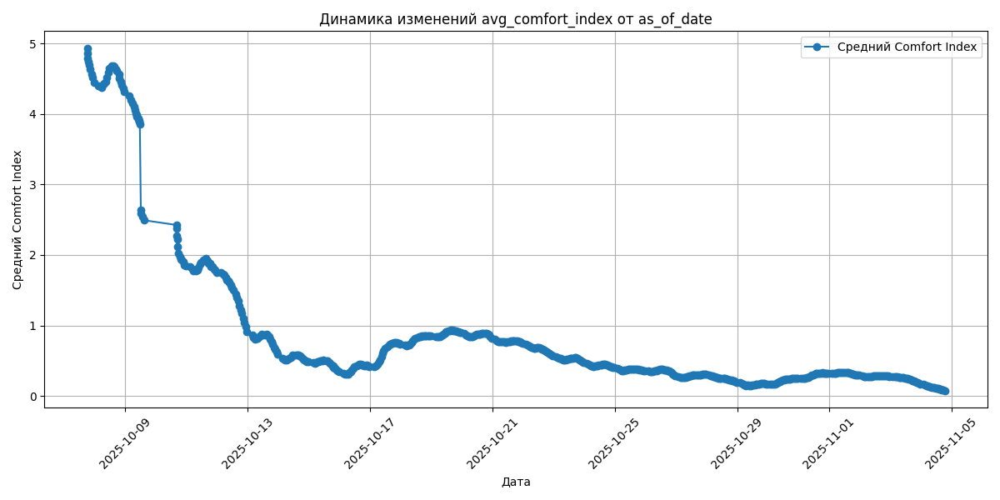
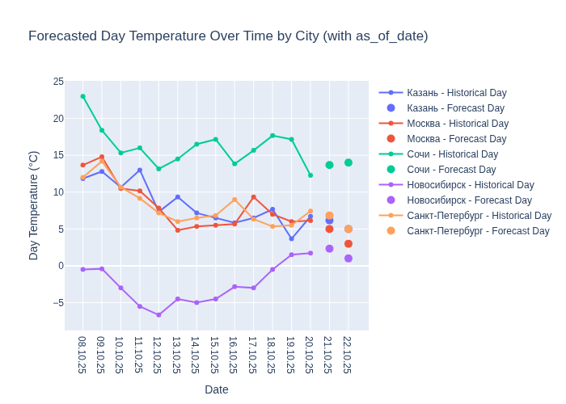
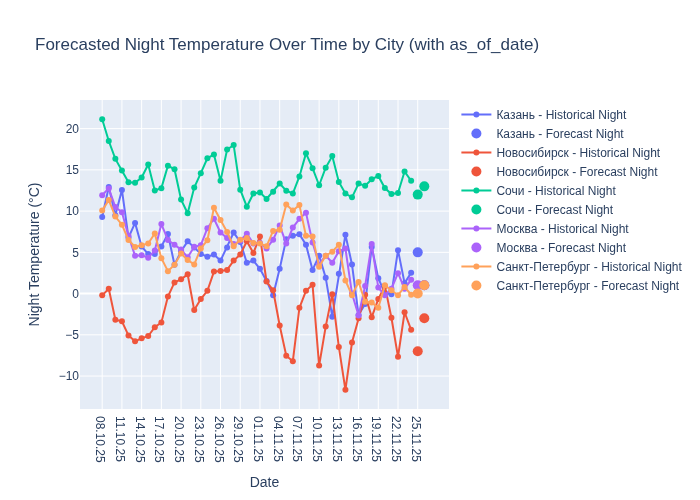
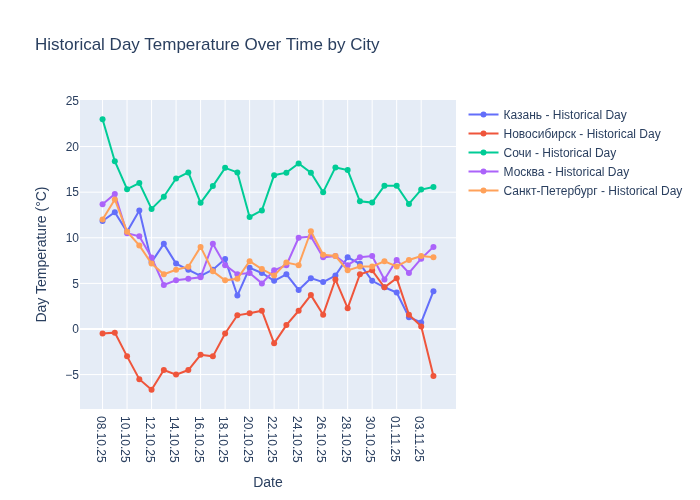
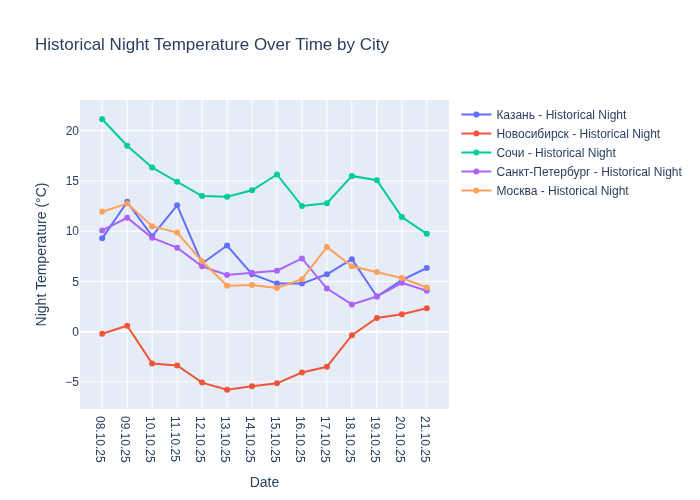

# Weather_tourism_pipeline
Данный пайплайн создан на основе данных от https://openweathermap.org.
Структура слоев следующая:
  1) слой raw: 
  собираем данные как есть, фиксируем дату загрузки в названии файлов.
  2) слой cleaned:
  очищаем данные слоя raw, группируем их по файлам за каждый день.
  3) слой enriched:
  обогащаем данные дополнительной информацией из справочника cities_reference.csv и формируем условие дневных и ночных температур,
  группируем загрузки также по дням, внутри ежедневного файла можно ориентироваться по дате загрузки as_of_date, чтобы отследить изменения внутри дня.
  4) слой aggregated:
   содержит витрины данных, тут файлы без дат в названии, даты сохранились внутри файла в поле as_of_date, это позволняет отслеживать динамику изменений.
  6) созданы дополнительные слои models и visualizations, в которых формируется предсказания погоды на завтра и визуализации для этой страницы.
  Пока не удалось победить: Сейчас на этой страницы отображается инфомрацию из витрин на максимальную as_of_date + визуализации с динамикой модельного прогноза температуры, 
  но не отображаются графики из generate_visualizations.py.
<!-- WEATHER DATA START -->
### Данные о погоде

#### Графики

#### Рейтинг туризма по городам
| city_name       |   avg_comfort_index | recommended_activity   | tourist_season_match   | tourism_season   | tour_recommendation       | as_of_date          |
|:----------------|--------------------:|:-----------------------|:-----------------------|:-----------------|:--------------------------|:--------------------|
| Новосибирск     |               -2.58 | домашний отдых         | нет                    | Июнь-Август      | домашний отдых вне сезона | 2025-10-14 09:39:00 |
| Москва          |               -0.79 | домашний отдых         | да                     | Круглогодично    | домашний отдых в сезон    | 2025-10-14 09:39:00 |
| Санкт-Петербург |                0.45 | домашний отдых         | нет                    | Май-Сентябрь     | домашний отдых вне сезона | 2025-10-14 09:39:00 |
| Казань          |                2.74 | домашний отдых         | нет                    | Май-Сентябрь     | домашний отдых вне сезона | 2025-10-14 09:39:00 |
| Сочи            |                2.88 | домашний отдых         | да                     | Май-Октябрь      | домашний отдых в сезон    | 2025-10-14 09:39:00 |

#### Сводка по федеральным округам
| federal_district   |   avg_temperature |   comfortable_cities_count | general_recommendation   | as_of_date          |
|:-------------------|------------------:|---------------------------:|:-------------------------|:--------------------|
| Приволжский        |              9.97 |                          0 | Лучше остаться дома      | 2025-10-14 09:39:00 |
| Центральный        |              9.25 |                          0 | Лучше остаться дома      | 2025-10-14 09:39:00 |
| Сибирский          |             -3.06 |                          0 | Лучше остаться дома      | 2025-10-14 09:39:00 |
| Северо-Западный    |              8.66 |                          0 | Лучше остаться дома      | 2025-10-14 09:39:00 |
| Южный              |             16.29 |                          0 | Лучше остаться дома      | 2025-10-14 09:39:00 |

#### Рекомендации для путешествий
Рекомендации на 2025-10-14: top_3_cities: nan, stay_home_cities: Казань, Москва, Новосибирск, Санкт-Петербург, Сочи, additional_notes: Казань: Взять теплую одежду; Плохая видимость из-за тумана/облачности; Москва: Взять теплую одежду; Плохая видимость из-за тумана/облачности; Новосибирск: Взять теплую одежду; Очень холодно, риск обморожения; Санкт-Петербург: Взять теплую одежду

#### Прогнозы температуры
| city            | forecast_date   |   predicted_temp_day |   predicted_temp_night | model_type       | as_of_date          |
|:----------------|:----------------|---------------------:|-----------------------:|:-----------------|:--------------------|
| Казань          | 2025-10-15      |                    8 |                      6 | LinearRegression | 2025-10-14 09:39:35 |
| Москва          | 2025-10-15      |                    6 |                      2 | LinearRegression | 2025-10-14 09:39:35 |
| Новосибирск     | 2025-10-15      |                    5 |                     -4 | LinearRegression | 2025-10-14 09:39:35 |
| Санкт-Петербург | 2025-10-15      |                    6 |                      4 | LinearRegression | 2025-10-14 09:39:35 |
| Сочи            | 2025-10-15      |                    9 |                     13 | LinearRegression | 2025-10-14 09:39:35 |

<!-- WEATHER DATA END -->
