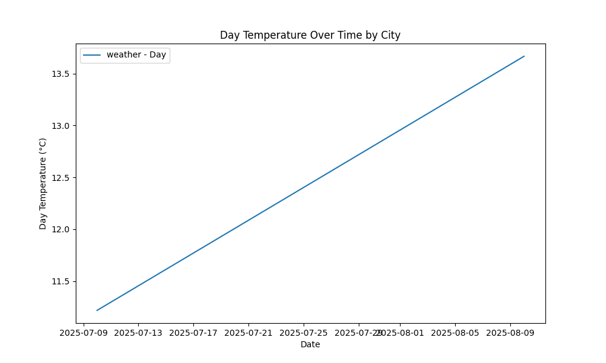
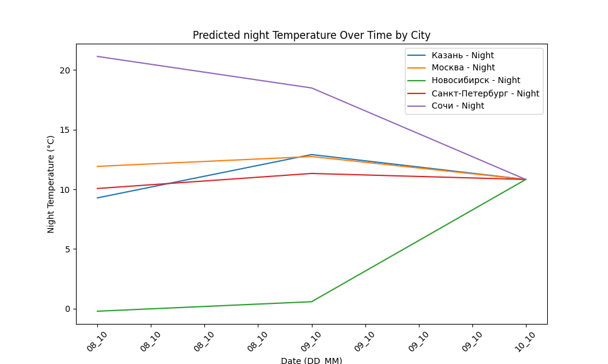

# Weather_tourism_pipeline

<!-- WEATHER DATA START -->
### Данные о погоде

#### Графики

#### Рейтинг туризма по городам
| city_name       |   avg_comfort_index | recommended_activity   | tourist_season_match   | tourism_season   | tour_recommendation       | as_of_date          |
|:----------------|--------------------:|:-----------------------|:-----------------------|:-----------------|:--------------------------|:--------------------|
| Новосибирск     |               -7.32 | домашний отдых         | нет                    | Июнь-Август      | домашний отдых вне сезона | 2025-10-09 15:00:00 |
| Москва          |                0.22 | домашний отдых         | да                     | Круглогодично    | домашний отдых в сезон    | 2025-10-09 15:00:00 |
| Казань          |                5.72 | домашний отдых         | нет                    | Май-Сентябрь     | домашний отдых вне сезона | 2025-10-09 15:00:00 |
| Санкт-Петербург |                6.85 | домашний отдых         | нет                    | Май-Сентябрь     | домашний отдых вне сезона | 2025-10-09 15:00:00 |
| Сочи            |                6.99 | домашний отдых         | да                     | Май-Октябрь      | домашний отдых в сезон    | 2025-10-09 15:00:00 |

#### Сводка по федеральным округам
| federal_district   |   avg_temperature |   comfortable_cities_count | general_recommendation   | as_of_date          |
|:-------------------|------------------:|---------------------------:|:-------------------------|:--------------------|
| Приволжский        |             11.35 |                          0 | Лучше остаться дома      | 2025-10-09 15:00:00 |
| Центральный        |             12.86 |                          0 | Лучше остаться дома      | 2025-10-09 15:00:00 |
| Сибирский          |             -0.03 |                          0 | Лучше остаться дома      | 2025-10-09 15:00:00 |
| Северо-Западный    |             11.35 |                          0 | Лучше остаться дома      | 2025-10-09 15:00:00 |
| Южный              |             20.22 |                          0 | Лучше остаться дома      | 2025-10-09 15:00:00 |

#### Рекомендации для путешествий
Рекомендации на 2025-10-09: top_3_cities: nan, stay_home_cities: Казань, Москва, Новосибирск, Санкт-Петербург, Сочи, additional_notes: Москва: Плохая видимость из-за тумана/облачности; Новосибирск: Взять теплую одежду; Очень холодно, риск обморожения; Плохая видимость из-за тумана/облачности

#### Прогнозы температуры
| city            | forecast_date   |   predicted_temp_day |   predicted_temp_night | model_type       | as_of_date          |
|:----------------|:----------------|---------------------:|-----------------------:|:-----------------|:--------------------|
| Казань          | 2025-10-10      |                   12 |                      9 | LinearRegression | 2025-10-09 15:00:13 |
| Москва          | 2025-10-10      |                   14 |                     12 | LinearRegression | 2025-10-09 15:00:13 |
| Новосибирск     | 2025-10-10      |                    0 |                      0 | LinearRegression | 2025-10-09 15:00:13 |
| Санкт-Петербург | 2025-10-10      |                   12 |                     10 | LinearRegression | 2025-10-09 15:00:13 |
| Сочи            | 2025-10-10      |                   23 |                     21 | LinearRegression | 2025-10-09 15:00:13 |

<!-- WEATHER DATA END -->
